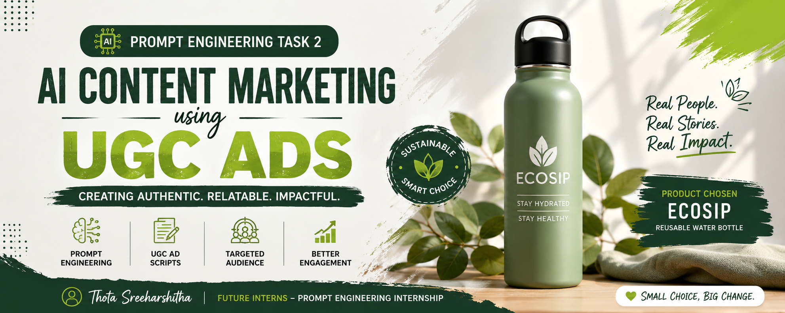
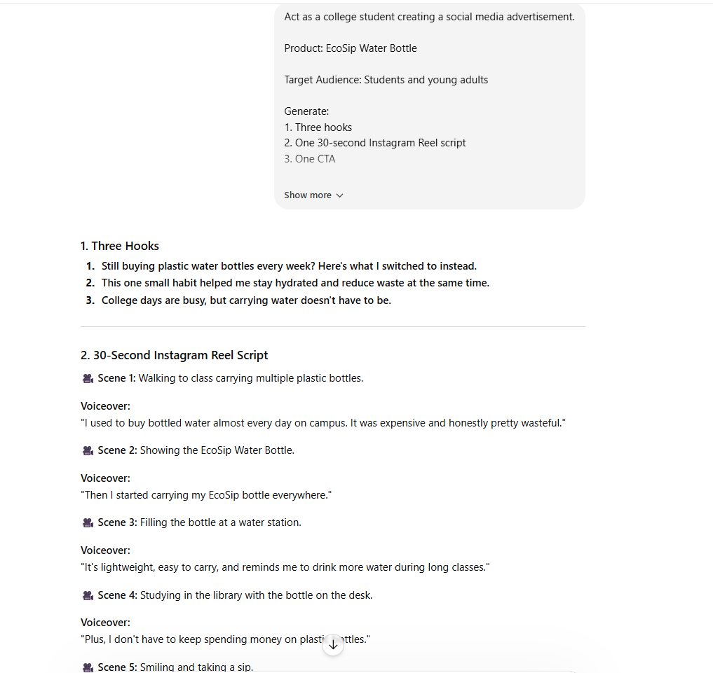

# Prompt Engineering Task 2 – AI Content Marketing using UGC Ads

## Project Overview

As part of my Prompt Engineering Internship at Future Interns, I completed this project to explore how AI can be used for content marketing through effective prompt design.

The goal of this task was to create User Generated Content (UGC) style advertisements using AI. I selected a reusable water bottle brand called EcoSip and used Prompt Engineering techniques to generate hooks, ad scripts, and call-to-actions that feel natural and relatable.

This project helped me understand how prompt structure influences the quality, tone, and effectiveness of AI-generated content.

---

# Objectives

* Understand the basics of Prompt Engineering
* Create prompts for marketing content generation
* Generate UGC-style advertisements using AI
* Compare different prompt outputs
* Learn how AI can assist in content creation and digital marketing

---

# Product Chosen

### EcoSip Reusable Water Bottle

EcoSip is a reusable water bottle designed for students and young adults who want to stay hydrated throughout the day while reducing plastic waste.

---

# Target Audience

* College Students
* Young Adults
* Daily Commuters
* People looking to improve their daily hydration habits

---

# Prompt Used

Act as a college student creating a social media advertisement.

Product: EcoSip Water Bottle

Target Audience: Students and young adults

Generate:

1. Three hooks
2. One 30-second Instagram Reel script
3. One CTA

Use a friendly and natural tone.

Avoid sounding like a sales advertisement.

---

# Generated Hooks

### Hook 1

I never thought a water bottle could actually make me drink more water.

### Hook 2

This is one thing I carry with me every day.

### Hook 3

Small change, but it made my daily routine much better.

---

# UGC Advertisement Script

### Hook

I never thought a water bottle could actually make me drink more water.

### Problem

I used to forget drinking enough water during classes.

### Solution

I started carrying the EcoSip bottle everywhere with me.

### Result

Now I stay hydrated throughout the day and feel more active. I also don't need to buy plastic bottles frequently.

### Call To Action

If you're a student like me, give it a try and see if it helps your routine too.

---

# Prompt Comparison

## Prompt Version 1

A simple prompt without audience details or tone instructions.

### Output

The generated advertisement felt generic and less engaging.

---

## Prompt Version 2

Added:

* Target audience
* Friendly tone
* UGC-style format

### Output

The generated advertisement felt more natural, relatable, and suitable for social media content.

---

## Observation

Providing more context and specific instructions significantly improved the quality of AI-generated content.

---

# Screenshots

The repository includes screenshots showing:

1. Prompt Input
2. Generated Hooks
3. Generated UGC Advertisement Script

These screenshots demonstrate the practical implementation of Prompt Engineering and the outputs generated using AI.
## Screenshots
### Prompt Input

### Prompt Input

### Prompt Input

-----
# Tools Used

* ChatGPT
* GitHub
* Prompt Engineering Techniques

---

# Skills Gained

* Prompt Engineering
* AI Content Generation
* Content Marketing
* UGC Ad Creation
* Documentation
* GitHub Repository Management

---

# What I Learned

While working on this project, I learned that AI-generated content depends heavily on how clearly prompts are written.

I observed that adding information such as audience, tone, and content structure helps produce more accurate and relevant results.

This task also helped me understand the practical applications of Prompt Engineering in content marketing and social media advertising.

---

# Conclusion

This project demonstrated how Prompt Engineering can be used to generate engaging marketing content using AI. By experimenting with different prompt structures, I was able to create more natural and relatable UGC-style advertisements.

The experience improved my understanding of AI-assisted content creation and showed how effective prompts can significantly enhance output quality.

---

# Author

### Thota Sreeharshitha

Future Interns – Prompt Engineering Internship

Project ID: FUTURE_PE_02
